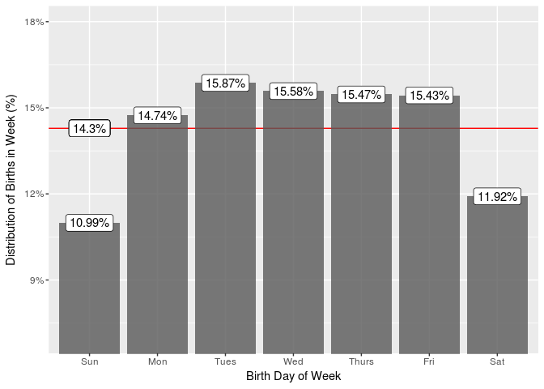
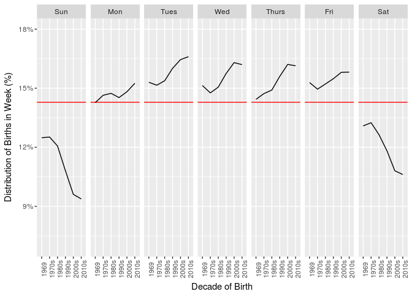

# Day of Week Exploration
[Back to Study Directory](README.md)


```r
library(vitalstatistics)
library(ggplot2)
library(dplyr)
library(lubridate)
```


```r
b.dow = births  # using a shorthand name for modified data set
```

One of the attributes that we have a nearly complete record for is day of the week. We'll start our analysis by comparing the distribution of live births throughout the week using the complete data set. A check for completeness of the data show that of the 179,279,500 records of live birth in our data set, we have 3,509,300 missing values for the `birth_weekday_date` that are missing data for day of week. We'll look at a breakdown of years where these values are missing (using the `birth_month_date`, which should be 100% complete).


```r
b.dow %>%  
    group_by(birth_year = year(birth_month_date)) %>%
    summarize(
        misses = sum(ifelse(is.na(birth_weekday_date), cases, 0)),
        cases = sum(cases),
        rate = misses / cases,
        rate_format = scales::percent(round(rate, digits=5))
    ) %>%
    filter(misses > 0) %>%
    select(
        `Birth Year` = birth_year,
        `Live Births` = cases,
        `# Missing Day of Week` = misses,
        `% Missing` = rate_format
    ) %>%
    knitr::kable(.)
```


 Birth Year   Live Births   # Missing Day of Week  % Missing 
-----------  ------------  ----------------------  ----------
       1968       3501400                 3501400  100%      
       1969       3600200                    2200  0.061%    
       1970       3737800                    3600  0.096%    
       1971       3563400                     600  0.017%    
       1972       3260500                     200  0.006%    
       1973       3139700                     400  0.013%    
       1974       3190500                     200  0.006%    
       1975       3159600                     100  0.003%    
       1976       3180000                     200  0.006%    
       1982       3688700                     400  0.011%    

We can see that 1968 is completely lacking day of week data, which is expected since birth records from that year included neither day of month or day of week data. However, after 1968 there is less than 1/10th of a percent of records missing from any year, with the worst years being 1969 and 1970, and missing data halting entirely after 1982. Overall, this is very complete data if we note that 1968 is missing in its entirety.

## Exploration

We start our exploratory analysis by preparing a copy of the data set with attributes that we will need later.


```r
b.dow = b.dow %>%
    filter(!is.na(birth_weekday_date)) %>%  # remove missing records
    mutate(
        birth_year = year(birth_weekday_date),  # add birth year
        birth_decade = ordered(paste0(floor((birth_year) / 10) * 10, "s")),  # add a decade label
        birth_decade = recode(birth_decade, '1960s' = '1969'),  # label 60's as 1969
        birth_weekday = wday(birth_weekday_date, label=TRUE)  # calculate and label day of week
    ) %>%
    group_by(birth_weekday)  # add a default grouping for weekday for convenience
```

Then we start our investigation by looking at the relative distribution of births over days of the week.


```r
dow.plot = function(dat) {  # create ggplot function for multiple use
    ggplot(dat, aes(birth_weekday, weekly_share, label=scales::percent(weekly_share))) +
        geom_hline(yintercept = 1/7, col="red") +  # draw a line at 14.3%
        geom_bar(stat="identity", alpha=0.80) +
        geom_label() +
        scale_y_continuous(labels=scales::percent) +
        coord_cartesian(ylim=c(0.07, 0.18)) +
        xlab("Birth Day of Week") +
        ylab("Distribution of Births in Week (%)")
}

b.dow %>%
    summarise(live_births = sum(cases)) %>%
    mutate(weekly_share = live_births / sum(live_births)) %>%
    dow.plot(.) + geom_label(aes(1, 1/7, label=scales::percent(1/7)))
```

<!-- -->

Our graph includes a line at 14.3%, which is where the weekly share of births would fall for each day if there was no bias toward any particular day. However, the graph reveals that births are not evenly distributed, with births much more heavily weighted towards weekdays than weekends. Sunday in particular falls well below the 14.3% non-bias level. 

To dive a little deeper into this question while still remaining at the "exploratory" level of analysis, we look at how this distribution has changed over time. We will make a nearly identical graph, but we will facet by decades so that we can see if there is a difference in the shape of the distribution over time. We are limiting to decades instead of individual years in order to reduce the number of facets that appear in our graph.


```r
b.dow.decades = b.dow %>%
    group_by(birth_decade, add=TRUE) %>%
    summarise(live_births = sum(cases)) %>%
    group_by(birth_decade) %>%  # group again on summarized data for denominator calculation
    mutate(weekly_share = live_births / sum(live_births))

b.dow.decades %>%
    dow.plot(.) + facet_grid(birth_decade ~ .)
```

<!-- -->

Although this produces a very busy graphic, with careful study we can see that the bias towards weekdays does exist throughout the decades in our data set, and appears to be more extreme in more recent decades. We will recast this graphic with a facet for each weekday, and track the decade on the y-axis.


```r
b.dow.decades %>%
    ggplot(aes(birth_decade, weekly_share, group=birth_weekday)) + 
        facet_grid(. ~ birth_weekday) +
        geom_hline(yintercept = 1/7, col="red") +
        geom_line(stat='identity') +
        scale_y_continuous(labels=scales::percent)+
        coord_cartesian(ylim=c(0.07, 0.18)) +
        theme(axis.text.x=element_text(angle=90, size=8)) +
        xlab("Decade of Birth") +
        ylab("Distribution of Births in Week (%)")
```

<!-- -->

With this final graphic, it becomes extremely clear that (1) births a much more heavily biased towards weekdays, (2) towards the middle of the week in particular, and (3) this trend has become more extreme over time. 

But what does this mean in plain language? We'll propose a theoretical week in which 7000 births occurred. If there was no bias on which day they were born and they occurred completely randomly, then ~1000 births would occur on each day. However, as of the 2010s, the week would probably look like this:


```r
b.dow.decades %>%
    filter(birth_decade == '2010s') %>%
    mutate(est = round(weekly_share / (1/7) * 1000, 0)) %>%
    group_by %>%  # drop decades grouping
    select(
        Weekday = birth_weekday,
        `Estimated Births` = est
    ) %>%
    knitr::kable(.)
```


Weekday    Estimated Births
--------  -----------------
Sun                     656
Mon                    1068
Tues                   1162
Wed                    1134
Thurs                  1130
Fri                    1107
Sat                     743

If historical trends hold, the bias of midweek births will continue to increase, with fewer births occurring on the weekend.

[Back to Study Directory](README.md)
