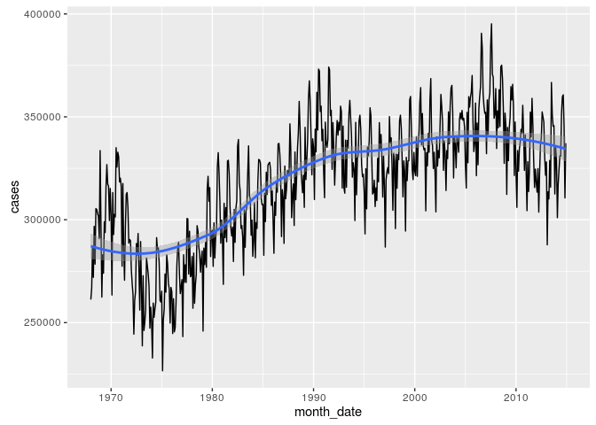
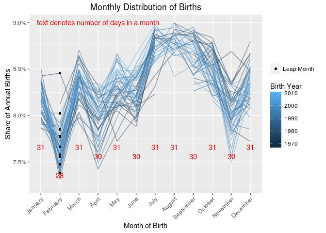
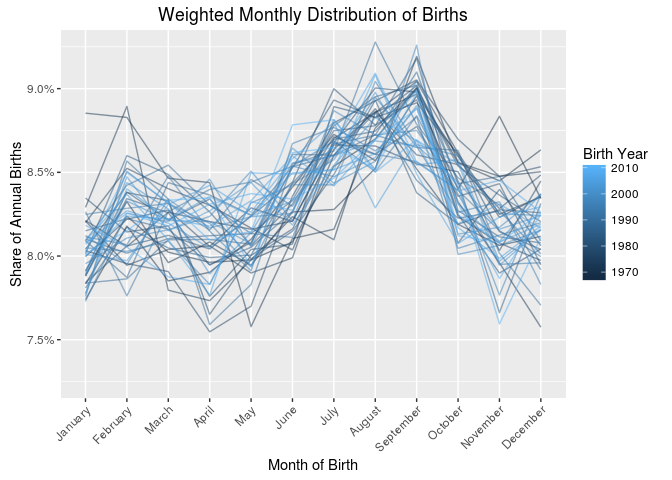
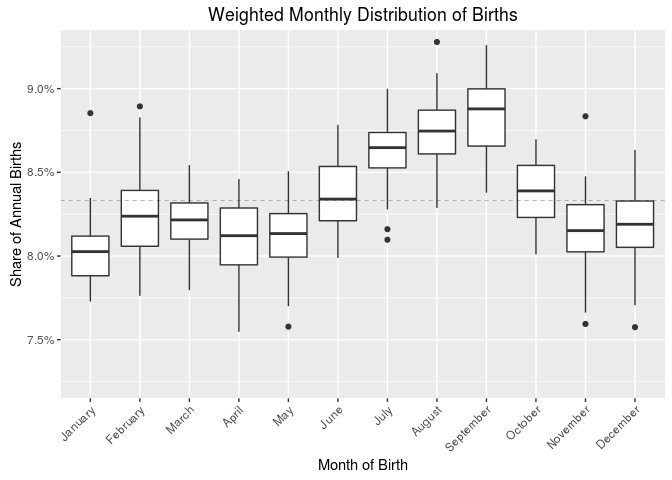
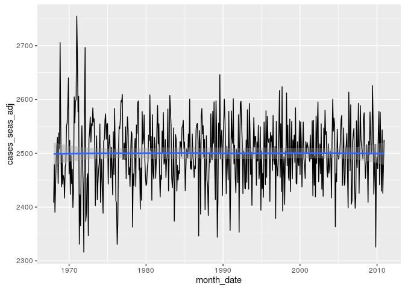
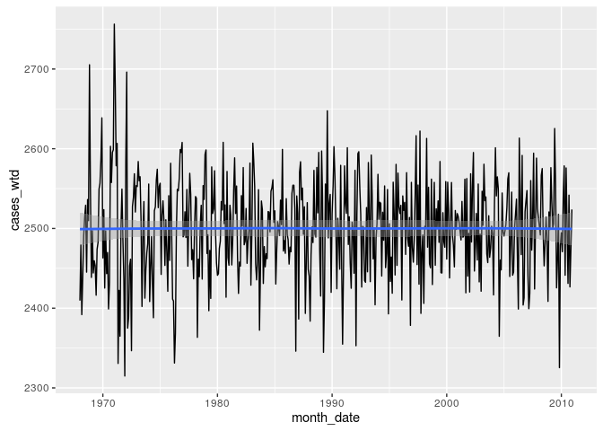

# Seasonal Birth Volumes
[Back to Document Directory](README.md)


```r
library(dplyr)
library(data.table)
library(lubridate)
library(ggplot2)
library(vitalstatistics)  # load the package that this study is part of
```

# Summary
There are many patterns that will appear in any data set, and all of them could potentially signal a relationship with an important factor. Others are more obviously the artifacts process or measurement. However in both cases we need to identify and define these patterns so that the irrelevant ones can be accounted for and excluded (i.e. silence the noise), and the interesting ones can be investigated.

## Monthly Calendar Adjustments

```r
births %>% str
```

```
## 'data.frame':	2797 obs. of  7 variables:
##  $ DOB_YY    : int  1968 1968 1968 1968 1968 1968 1968 1968 1968 1968 ...
##  $ DOB_MM    : Ord.factor w/ 12 levels "January"<"February"<..: 1 2 3 4 5 6 7 8 9 10 ...
##  $ cases     : int  2360 2333 2394 2332 2470 2482 2661 2613 2643 2561 ...
##  $ BFACIL3   : Ord.factor w/ 3 levels "In Hospital"<..: NA NA NA NA NA NA NA NA NA NA ...
##  $ ME_ROUT   : Ord.factor w/ 5 levels "Spontaneous"<..: NA NA NA NA NA NA NA NA NA NA ...
##  $ RF_CESAR  : Ord.factor w/ 3 levels "Yes"<"No"<"Unknown or not stated": NA NA NA NA NA NA NA NA NA NA ...
##  $ month_date: Date, format: "1968-01-01" "1968-02-01" ...
```
We start by loading the standard births data set, and then examining the volume of births that occur on a monthly basis. Month is the most granular level of date that we are likely to work with since the recent birth certificate data published by the CDC does not get any more granular (all though some old years do include the day of the month).


```r
births %>% group_by(month_date) %>%
    summarize(cases = sum(cases)) %>%
    ggplot(aes(month_date, cases)) +
        geom_line(stat="identity") +
        geom_smooth()
```

<!-- -->

In general we see an increase in the overall volume of births occuring in the US, wth a flattening of the overall pattern in the 90's and 00's. The reader may also notice an annually recurring pattern, with one broad spike occuring in each year. This can be made more clear by overplotting each year of data that we have on a month-by-month basis as a percentage of births for the entire year that occured in each month.


```r
births_monthly_share = births %>% 
    group_by(DOB_YY, DOB_MM, month_date) %>%
    summarize(cases = sum(cases)) %>%
    group_by(DOB_YY) %>%
    mutate(
        annual_cases = sum(cases),
        annual_share = cases / annual_cases,
        leap_month = ifelse(leap_year(DOB_YY) & DOB_MM == 'February', annual_share, NA)
        )

day_counter = data.table(MM = 1:12) %>% 
    mutate(
        days = (ymd(19010101) + months(1:12) - (ymd(19010101) + months(0:11))) %>% days %>% .@day,
        ypos = (days - 28) * 0.001 + 0.075
    )

ggplot(births_monthly_share, aes(DOB_MM, annual_share, group=DOB_YY)) +
    ggtitle("Monthly Distribution of Births") +
    geom_line(aes(color=DOB_YY), alpha=0.5) + scale_color_continuous(name="Birth Year") +
    geom_point(aes(y=leap_month, shape="Leap Month"), na.rm=TRUE) + scale_shape_discrete(name=NULL) +
    ylab("Share of Annual Births") + 
    scale_y_continuous(labels=scales::percent, limits=c(0.0725, 0.090)) +
    xlab("Month of Birth") + theme(axis.text.x = element_text(angle=45, hjust=1)) +
    geom_text(data=day_counter, aes(x=MM, y=ypos, group=NULL, label=days), color="red", vjust=3) +
    annotate("text", x=4, y=0.09, label="text denotes number of days in a month", color="red")
```

```
## Warning: Removed 1 rows containing missing values (geom_path).
```

<!-- -->

There is an artifact (i.e. noise) caused by the way that the Julian calendar works which is made clear in this graphic. The To help illustrate the point, we've plotted the number of days in each month in red (we show February as 28 although there are some years with 29 days, which have been denoted). This allows us to very easily see that the proportional number of births in each month vary according to the number of days. This makes a great deal of sense; months are not equal interval units, and there is little reason to believe that the population would somehow coordinate an equal distribution of birth across each month. The theory that this pattern is a result of the varying number of days in a month - rather than th result of a different confounding factor which operates on alternating months - is supported by the fact that the dip in proportional rates are less or even reversed in July and Auguest where two 31 days months are back to back, as well as by the more severe dip in February, which is somewhat muted during leap years.

Clearly, in order to identify other patterns in our data that might be driven by factors related to time, we first need to control for the effect of the varying number of days in each month. Our solution is to weight the count of births so that each month is treated as if it's an equal interval. This is accomplished by calculating the share of days in that month (e.g. `30/365`) for the year, as a proportion of months in the year (e.g.`(1/12) / (30/365)`). 


```r
dim_month_calendar = 
    births_monthly_share %>% group_by %>%
        transmute(
            mc_date = month_date,
            mc_year = DOB_YY,
            mc_month = DOB_MM,
            mc_year_days = ymd(paste0(DOB_YY,"0101")),
            mc_year_days = (mc_year_days + years(1) - mc_year_days) %>% days %>% .@day,
            mc_month_days = ymd(paste0(DOB_YY, DOB_MM, "01")),
            mc_month_days = (mc_month_days + months(1) - mc_month_days) %>% days %>% .@day,
            mc_artifact_volume_wgt =  (1/12) / (mc_month_days / mc_year_days),

            annual_births_share = annual_share,
            annual_births_share_wtd = annual_births_share * mc_artifact_volume_wgt
        )
```
We create a dimension table where `month_date` acts as our key, with weighting values calculated for
each month that exists in our births data set. These can be applied to any analysis of volume that
we perform on a monthly basis to mute the noise caused by calendar month artifacts. We do so with
an inner join, and a simple mutation of the annual share calculation.


```r
p = dim_month_calendar %>%
    ggplot(aes(mc_month, annual_births_share_wtd, group=mc_year)) +
        ggtitle("Weighted Monthly Distribution of Births") +
        ylab("Share of Annual Births") + 
        scale_y_continuous(labels=scales::percent, limits=c(0.0725, 0.090)) +
        xlab("Month of Birth") + theme(axis.text.x = element_text(angle=45, hjust=1))

p + geom_line(aes(color=mc_year), alpha=0.5) + scale_color_continuous(name="Birth Year")
```

<!-- -->

We can see that the monthly oscillations are much more muted, and that we've successfully muted muted some of the noise in our data.

## Seasonal Trends
After removing the oscillations caused by varying length months, it's clear that there's still a strong pattern related to date. There's an increasing share of births that occur from January onward, until the peak in August, which drops dramatically until January of the next year. We can help the eye somewhat with the overplotting of all these different years by using boxplots.


```r
p + geom_boxplot(aes(group=mc_month)) +
    geom_hline(yintercept = 1/12, size=0.10, linetype=2)
```

```
## Warning: Removed 16 rows containing non-finite values (stat_boxplot).
```

<!-- -->

In addition to the boxplots we include a horizontal line at 8.33%, which shows us where the mean of each boxplot should lie if there were no differences in the share of births that occur in each month after adjusting for calendar artifacts. 

We use a linear regression model to calculate a new weight to account for the seasonal peak that
occurs in the second quarter of the year.


```r
dim_month_calendar$mc_seasonal_volume_wgt = 
    ((1/12) / lm(annual_births_share_wtd ~ mc_month, dim_month_calendar)$fitted.values)

dim_month_calendar = dim_month_calendar %>%
    mutate(annual_births_share_wtd = 
               annual_births_share * mc_artifact_volume_wgt * mc_seasonal_volume_wgt
           )
```


```r
ggplot(dim_month_calendar,aes(mc_month, annual_births_share_wtd, group=mc_year)) +
    ggtitle("Weighted Monthly Distribution of Births") +
    ylab("Share of Annual Births") + 
    scale_y_continuous(labels=scales::percent, limits=c(0.0725, 0.090)) +
    xlab("Month of Birth") + theme(axis.text.x = element_text(angle=45, hjust=1)) + 
    geom_line(aes(color=mc_year)) + scale_color_continuous(name="Birth Year")
```

```
## Warning: Removed 1 rows containing missing values (geom_path).
```

<!-- -->

Prune intermediate fields to make the table more of a dimension.


```r
dim_month_calendar = select(dim_month_calendar, mc_date , starts_with('mc_'))
```


```r
births %>%
    inner_join(dim_month_calendar, by=c('month_date' = 'mc_date')) %>%
    mutate(cases_wtd = cases * mc_seasonal_volume_wgt * mc_artifact_volume_wgt) %>%
    group_by(month_date) %>%
    summarize(cases_wtd = sum(cases_wtd)) %>%
    ggplot(aes(month_date, cases_wtd)) +
        geom_line(stat="identity") +
        geom_smooth()
```

<!-- -->
